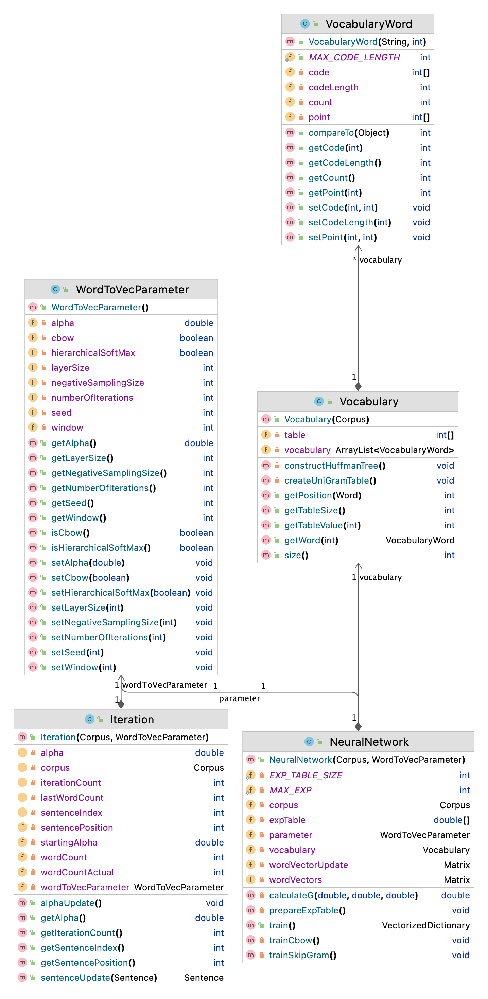

Word Embeddings
============

Distributed representations (DR) of words (i.e., word embeddings) are used to capture semantic and syntactic regularities of the language by analyzing distributions of word relations within the textual data. Modeling methods generating DRs rely on the assumption that 'words that occur in similar contexts tend to have similar meanings' (distributional hypothesis) which stems from the nature of language itself. Due to their unsupervised nature, these modeling methods do not require any human judgement input to train, which allows researchers to train very large datasets in relatively low costs.

Traditional representations of words (i.e., one-hot vectors) are based on word-word (W x W) co-occurrence sparse matrices where W is the number of distinct words in the corpus. On the other hand, distributed word representations (DRs) (i.e., word embeddings) are word-context (W x C) dense matrices where C < W and C is the number of context dimensions which are determined by underlying model assumptions. Dense representations are arguably better at capturing generalized information and more resistant to overfitting due to context vectors representing shared properties of words. DRs are real valued vectors where each context can be considered as a continuous feature of a word. Due to their ability to represent abstract features of a word, DRs are considered as reusable across higher level tasks in ease, even if they are trained with totally different datasets.

Prediction based DR models gained much attention after Mikolov et al.’s neural network based SkipGram model in 2013. The secret behind the prediction based models is simple: never build a sparse matrix at all. Prediction based models construct dense matrix representations directly instead of reducing sparse ones to dense ones. These models are trained like any other supervised learning task by giving lots of positive and negative samples without adding any human supervision costs. Aim of these models is to maximize the probability of each context c with the same distributional assumptions on word-context co-occurrences, similar to count based models.

SkipGram is a prediction based distributional semantic model (DSM) consisting of a shallow neural network architecture inspired from neural language modeling (LM) intuitions. It is commonly known for its open-source implementation library word2vec. SkipGram acts like a log-linear classifier maximizing the prediction of the surrounding words of a word within a context (center window). Probabilistic word and sentence prediction by local neighbors of a word has been successfully applied on LM tasks under Markov assumption. SkipGram leverages the same idea by considering the words within the window as positive and negative instances and learning weights (for k contexts) which maximizes word predictions. In the training process, each word vector starts as a random vector, and then iteratively shifts to the neighboring vector.


Video Lectures
============

[](https://youtu.be/7zaTW8dH_QMc)[](https://youtu.be/4YvBJ_p8HRc)[](https://youtu.be/Hh-MM_rSWeo)

For Developers
============

You can also see [Python](https://github.com/starlangsoftware/WordToVec-Py), [Cython](https://github.com/starlangsoftware/WordToVec-Cy), [C](https://github.com/starlangsoftware/WordToVec-C), [C++](https://github.com/starlangsoftware/WordToVec-CPP), [Swift](https://github.com/starlangsoftware/WordToVec-Swift), 
[Js](https://github.com/starlangsoftware/WordToVec-Js) or [C#](https://github.com/starlangsoftware/WordToVec-CS) repository.

## Requirements

* [Java Development Kit 8 or higher](#java), Open JDK or Oracle JDK
* [Maven](#maven)
* [Git](#git)

### Java 

To check if you have a compatible version of Java installed, use the following command:

    java -version
    
If you don't have a compatible version, you can download either [Oracle JDK](https://www.oracle.com/technetwork/java/javase/downloads/jdk8-downloads-2133151.html) or [OpenJDK](https://openjdk.java.net/install/)    

### Maven
To check if you have Maven installed, use the following command:

    mvn --version
    
To install Maven, you can follow the instructions [here](https://maven.apache.org/install.html).      

### Git

Install the [latest version of Git](https://git-scm.com/book/en/v2/Getting-Started-Installing-Git).

## Download Code

In order to work on code, create a fork from GitHub page. 
Use Git for cloning the code to your local or below line for Ubuntu:

	git clone <your-fork-git-link>

A directory called WordToVec will be created. Or you can use below link for exploring the code:

	git clone https://github.com/olcaytaner/WordToVec.git

## Open project with IntelliJ IDEA

Steps for opening the cloned project:

* Start IDE
* Select **File | Open** from main menu
* Choose `WordToVec/pom.xml` file
* Select open as project option
* Couple of seconds, dependencies with Maven will be downloaded. 


## Compile

**From IDE**

After being done with the downloading and Maven indexing, select **Build Project** option from **Build** menu. After compilation process, user can run WordToVec.

**From Console**

Go to `WordToVec` directory and compile with 

     mvn compile 

## Generating jar files

**From IDE**

Use `package` of 'Lifecycle' from maven window on the right and from `WordToVec` root module.

**From Console**

Use below line to generate jar file:

     mvn install

## Maven Usage

        <dependency>
            <groupId>io.github.starlangsoftware</groupId>
            <artifactId>WordToVec</artifactId>
            <version>1.0.8</version>
        </dependency>

Detailed Description
============

To initialize artificial neural network:

	NeuralNetwork(Corpus corpus, WordToVecParameter parameter)

To train neural network:

	VectorizedDictionary train()

# Cite

	@inproceedings{ercan-yildiz-2018-anlamver,
    	title = "{A}nlam{V}er: Semantic Model Evaluation Dataset for {T}urkish - Word Similarity and Relatedness",
    	author = {Ercan, G{\"o}khan  and
      	Y{\i}ld{\i}z, Olcay Taner},
    	booktitle = "Proceedings of the 27th International Conference on Computational Linguistics",
    	month = aug,
    	year = "2018",
    	address = "Santa Fe, New Mexico, USA",
    	publisher = "Association for Computational Linguistics",
    	url = "https://www.aclweb.org/anthology/C18-1323",
    	pages = "3819--3836",
	}

For Contibutors
============

### Class Diagram



### pom.xml file
1. Standard setup for packaging is similar to:
```
    <groupId>io.github.starlangsoftware</groupId>
    <artifactId>Amr</artifactId>
    <version>1.0.0</version>
    <packaging>jar</packaging>
    <name>NlpToolkit.Amr</name>
    <description>Abstract Meaning Representation Library</description>
    <url>https://github.com/StarlangSoftware/Amr</url>

    <organization>
        <name>io.github.starlangsoftware</name>
        <url>https://github.com/starlangsoftware</url>
    </organization>

    <licenses>
        <license>
            <name>The Apache Software License, Version 2.0</name>
            <url>http://www.apache.org/licenses/LICENSE-2.0.txt</url>
        </license>
    </licenses>

    <developers>
        <developer>
            <name>Olcay Taner Yildiz</name>
            <email>olcay.yildiz@ozyegin.edu.tr</email>
            <organization>Starlang Software</organization>
            <organizationUrl>http://www.starlangyazilim.com</organizationUrl>
        </developer>
    </developers>

    <scm>
        <connection>scm:git:git://github.com/starlangsoftware/amr.git</connection>
        <developerConnection>scm:git:ssh://github.com:starlangsoftware/amr.git</developerConnection>
        <url>http://github.com/starlangsoftware/amr/tree/master</url>
    </scm>

    <properties>
        <maven.compiler.source>1.8</maven.compiler.source>
        <maven.compiler.target>1.8</maven.compiler.target>
        <project.build.sourceEncoding>UTF-8</project.build.sourceEncoding>
    </properties>
```
2. Only top level dependencies should be added. Do not forget junit dependency.
```
    <dependencies>
        <dependency>
            <groupId>io.github.starlangsoftware</groupId>
            <artifactId>AnnotatedSentence</artifactId>
            <version>1.0.78</version>
        </dependency>
        <dependency>
            <groupId>junit</groupId>
            <artifactId>junit</artifactId>
            <version>4.13.1</version>
            <scope>test</scope>
        </dependency>
    </dependencies>
```
3. Maven compiler, gpg, source, javadoc plugings should be added.
```
	<plugin>
		<groupId>org.apache.maven.plugins</groupId>
		<artifactId>maven-compiler-plugin</artifactId>
		<version>3.6.1</version>
		<configuration>
			<source>1.8</source>
			<target>1.8</target>
		</configuration>
	</plugin>
	<plugin>
		<groupId>org.apache.maven.plugins</groupId>
		<artifactId>maven-gpg-plugin</artifactId>
		<version>1.6</version>
		<executions>
			<execution>
				<id>sign-artifacts</id>
				<phase>verify</phase>
				<goals>
					<goal>sign</goal>
				</goals>
			</execution>
		</executions>
	</plugin>
	<plugin>
		<groupId>org.apache.maven.plugins</groupId>
		<artifactId>maven-source-plugin</artifactId>
		<version>2.2.1</version>
		<executions>
			<execution>
				<id>attach-sources</id>
				<goals>
					<goal>jar-no-fork</goal>
				</goals>
			</execution>
		</executions>
	</plugin>
	<plugin>
		<groupId>org.apache.maven.plugins</groupId>
		<artifactId>maven-javadoc-plugin</artifactId>
		<configuration>
			<source>8</source>
		</configuration>
		<version>3.10.0</version>
		<executions>
			<execution>
				<id>attach-javadocs</id>
				<goals>
					<goal>jar</goal>
				</goals>
			</execution>
		</executions>
	</plugin>
```
4. Currently publishing plugin is Sonatype.
```
	<plugin>
		<groupId>org.sonatype.central</groupId>
		<artifactId>central-publishing-maven-plugin</artifactId>
		<version>0.8.0</version>
		<extensions>true</extensions>
		<configuration>
			<publishingServerId>central</publishingServerId>
			<autoPublish>true</autoPublish>
		</configuration>
	</plugin>
```
5. For UI jar files use assembly plugins.
```
	<plugin>
		<groupId>org.apache.maven.plugins</groupId>
		<artifactId>maven-assembly-plugin</artifactId>
		<version>2.2-beta-5</version>
		<executions>
			<execution>
				<id>sentence-dependency</id>
				<phase>package</phase>
				<goals>
					<goal>single</goal>
				</goals>
				<configuration>
					<archive>
						<manifest>
							<mainClass>Amr.Annotation.TestAmrFrame</mainClass>
						</manifest>
					</archive>
					<finalName>amr</finalName>
				</configuration>
			</execution>
		</executions>
		<configuration>
			<descriptorRefs>
				<descriptorRef>jar-with-dependencies</descriptorRef>
			</descriptorRefs>
			<appendAssemblyId>false</appendAssemblyId>
		</configuration>
	</plugin>
```
### Resources
1. Add resources to the resources subdirectory. These will include image files (necessary for UI), data files, etc.
   
### Java files
1. Do not forget to comment each function.
```
    /**
     * Returns the value of a given layer.
     * @param viewLayerType Layer for which the value questioned.
     * @return The value of the given layer.
     */
    public String getLayerInfo(ViewLayerType viewLayerType){
```
2. Function names should follow caml case.
```
    public MorphologicalParse getParse()
```
3. Write toString methods, if necessary.
4. Use Junit for writing test classes. Use test setup if necessary.
```
public class AnnotatedSentenceTest {
    AnnotatedSentence sentence0, sentence1, sentence2, sentence3, sentence4;
    AnnotatedSentence sentence5, sentence6, sentence7, sentence8, sentence9;

    @Before
    public void setUp() throws Exception {
        sentence0 = new AnnotatedSentence(new File("sentences/0000.dev"));
```
